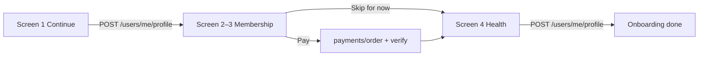

# Profile onboarding — API mapping (Figma screens)

After OTP/Google login (`isNewUser: true`), the app walks through profile setup, optional membership, and health info.

All endpoints require `Authorization: Bearer <accessToken>` and `x-api-key` on AWS.

## Screen order & API calls

| Screen | User action | API call |
|--------|-------------|----------|
| 1 — Create your profile | **Continue** | **`POST /users/me/profile`** (required — save name, DOB, photo, etc.) |
| 2–3 — Become a member | **Continue** (pay) | `GET /membership/plans` → `POST /payments/order` → Razorpay → `POST /payments/verify` |
| 2–3 — Become a member | **Skip for now** | **No API** — only skips membership payment; profile from screen 1 is already saved |
| 4 — Health info | **Continue** | **`POST /users/me/health-info`** |
| 4 — Health info | **Skip for now** | No API |
| 5 — Approval in progress | **Continue** | **`GET /membership/me`** then **`GET /home`** |
| Homescreen | Load | **`GET /home`** |

**Important:** Screen 1 **must** call `POST /users/me/profile` before navigating to membership. “Skip for now” on membership does **not** mean skip saving profile — it only means the user declines to pay right now.



---

## Screen 1 — Create your profile

### Profile photo (presigned S3 upload)

The app does **not** upload the image to the API directly. Flow:

1. **Get upload URL**

```
POST /api/v1/users/me/upload-url
{
  "folder": "profiles",
  "fileName": "avatar.jpg",
  "contentType": "image/jpeg",
  "fileSizeBytes": 204800
}
```

Response: `{ url, key }` — presigned PUT URL (15 min expiry).

2. **Upload file** — `PUT` the image bytes to `url` with header `Content-Type: image/jpeg` (or `image/png`).

   Constraints: JPG/PNG only, max **5 MB**.

3. **Save profile** — include `photoKey: key` in `POST /users/me/profile` (step below).

4. **Display photo** — `GET /api/v1/users/me` returns `photoUrl` (presigned read URL, 1 h).

### Create profile (onboarding)

Use **`POST /api/v1/users/me/profile`** during onboarding (until `profileCompletion` reaches 100%).
Use **`PUT /api/v1/users/me`** for later edits (settings, etc.).

**Screen 1 — basic profile:**

```
POST /api/v1/users/me/profile
{
  "firstName": "Rahul",
  "lastName": "Sharma",
  "dob": "1990-05-15",
  "gender": "male",
  "email": "rahul@example.com",
  "state": "Maharashtra",
  "city": "Mumbai",
  "photoKey": "profiles/<userId>/<uuid>-avatar.jpg"
}
```

`firstName` + `lastName` are combined into `fullName`. Returns **409** once `profileCompletion` is 100%.

---

## Screens 2–3 — Become a member

### List plans

```
GET /api/v1/membership/plans
```

Returns active plans, e.g. Swasth Mitra Membership at ₹99/year with benefits list.

### Purchase (Razorpay)

```
POST /api/v1/payments/order
{
  "purpose": "MEMBERSHIP",
  "amount": 99,
  "planId": "<id from plans>"
}
```

Open Razorpay Checkout with returned `orderId`, `keyId`, `amount`.

```
POST /api/v1/payments/verify
{
  "razorpay_order_id": "...",
  "razorpay_payment_id": "...",
  "razorpay_signature": "..."
}
```

On success, a `Membership` row is created with `status: under_review`. **`User.status` stays `PENDING`** until an admin approves — the app should show screen 5 (“Approval in progress”) with `approvalStatus: UNDER_REVIEW`, not treat the user as fully active yet.

See **[`MEMBERSHIP_PAYMENT_FLOW.md`](./MEMBERSHIP_PAYMENT_FLOW.md)** for Razorpay integration, database changes, admin workflow, renewal, and expiry.

**Skip for now** — no payment API; navigate to screen 4 (health info). Profile data from screen 1 is already on the server. Membership features stay locked until the user pays later (`GET /membership/me` → `hasMembership: false`).

---

## Screen 4 — Health info (Basic Details)

Prefill (optional):

```
GET /api/v1/users/me/health-info
```

**Continue** → save:

```
POST /api/v1/users/me/health-info
{
  "bloodGroup": "O+",
  "pastHealthIssues": "None in the last 5 years",
  "chronicConditions": "None",
  "diabetesInfo": "No",
  "bloodPressureInfo": "No",
  "healthNotes": "No other conditions"
}
```

**Skip for now** → no API; go to approval or home.

---

## Screen 5 — Approval in progress

Shown when user **paid** for membership and admin has not approved yet.

```
GET /api/v1/membership/me
```

Returns `approvalStatus: UNDER_REVIEW`, plan details, `amountPaid`, benefits list, and status message.

**Continue** → `GET /api/v1/home` (homescreen).

If user skipped membership, skip this screen and go straight to home.

---

## Homescreen

```
GET /api/v1/home
```

Returns user header (`membershipLabel`, `photoUrl`), services grid (badges), donation ticker, profile completion banner, and `canRaiseFunds` / `canDonate` flags.

Poll `GET /membership/me` or `GET /home` after admin approval — `approvalStatus` becomes `APPROVED`, `membershipLabel` becomes `Premium Member`.

---

## Check progress

```
GET /api/v1/users/me
```

Returns full profile, `profileCompletion`, `photoUrl`, `membership`, `wallet`, `familyMembers`.

---

## API reference

See [`openapi/openapi.yaml`](../openapi/openapi.yaml) — tags **Users**, **Membership**, **Home**, **Payments**.

**Membership payment (Razorpay), DB changes, admin approval, renewal & expiry:** [`MEMBERSHIP_PAYMENT_FLOW.md`](./MEMBERSHIP_PAYMENT_FLOW.md).
