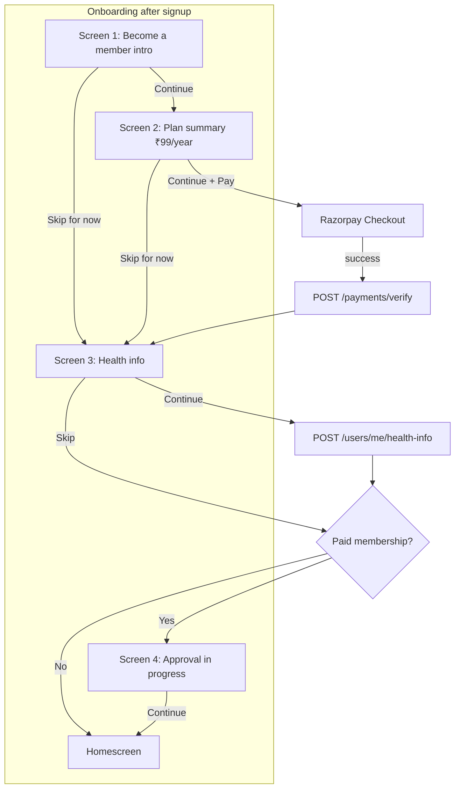
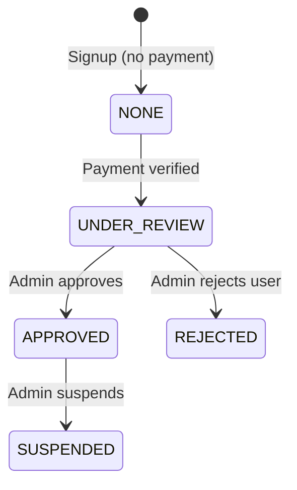

# Membership payment flow — mobile app developer guide

This document maps the **Figma onboarding screens** (intro → plan → health info → approval in progress) to the Swasth Mitra API, Razorpay Checkout, database changes, admin workflow, renewal, and expiry.

**Related:** [`PROFILE_ONBOARDING.md`](./PROFILE_ONBOARDING.md) (screen-by-screen API calls), [`openapi/openapi.yaml`](../openapi/openapi.yaml) (schemas), [`MOBILE_AUTH.md`](./MOBILE_AUTH.md) (auth headers).

---

## 1. Screen flow (Figma → app logic)



| Figma screen | When to show | Key API |
|--------------|--------------|---------|
| **1 — Become a Swasth Mitra Member** (benefits list) | After profile is saved (screen 1 of onboarding) | None — static copy; benefits also come from `GET /membership/plans` |
| **2 — Plan summary card** (₹99, 1 year, benefits) | User taps Continue on screen 1 | `GET /membership/plans` |
| **Payment** (Razorpay modal — not a separate Figma screen) | User taps Continue on plan screen | `POST /payments/order` → Checkout → `POST /payments/verify` |
| **3 — Basic details / Health info** | After pay or skip membership | `GET /users/me/health-info` (prefill), `POST /users/me/health-info` (save) |
| **4 — Approval in progress** (“Under Review”, amount paid ₹99) | **Only if user completed payment** | `GET /membership/me` |
| **Homescreen** | After screen 4 Continue, or skip path | `GET /home` |

**Routing rule for screen 4:** Show “Approval in progress” when `GET /membership/me` returns `hasMembership: true` **and** `approvalStatus: "UNDER_REVIEW"`. If the user skipped payment, go straight to home.

---

## 2. Prerequisites (before membership screens)

User must be logged in (`Authorization: Bearer <accessToken>`). On AWS, also send `x-api-key`.

Profile from onboarding screen 1 should already be saved:

```
POST /api/v1/users/me/profile
```

See [`PROFILE_ONBOARDING.md`](./PROFILE_ONBOARDING.md) for photo upload (`POST /users/me/upload-url` → S3 PUT → `photoKey` in profile).

---

## 3. Step-by-step: payment integration

### 3.1 List plans (plan summary screen)

```http
GET /api/v1/membership/plans
Authorization: Bearer <token>
```

**Response `data` (array):**

```json
[
  {
    "id": "uuid",
    "name": "Swasth Mitra Membership",
    "fee": 99,
    "validityDays": 365,
    "validityLabel": "1 year",
    "benefits": [
      "Raise funds for medical treatments",
      "Access partner hospitals and healthcare services"
    ]
  }
]
```

Use `id` as `planId`, `fee` as payment amount, `benefits` for the checklist UI.

### 3.2 Create Razorpay order (server-side)

```http
POST /api/v1/payments/order
Authorization: Bearer <token>
Content-Type: application/json

{
  "purpose": "MEMBERSHIP",
  "amount": 99,
  "planId": "<id from plans>"
}
```

**Response `data`:**

```json
{
  "orderId": "order_xxxxxxxx",
  "amount": 9900,
  "currency": "INR",
  "keyId": "rzp_test_xxxxxxxx"
}
```

| Field | Notes |
|-------|--------|
| `amount` | In **paise** (9900 = ₹99). Pass this to Razorpay Checkout. |
| `orderId` | Razorpay order id — required in Checkout `order_id`. |
| `keyId` | Razorpay Key ID for Checkout `key`. |

**App responsibility:** Always send `amount` equal to `plan.fee` from step 3.1. The server does not yet validate amount against plan price (see [§8](#8-api-gaps--recommended-backend-changes)).

### 3.3 Open Razorpay Checkout (client)

Use [Razorpay Standard Checkout](https://razorpay.com/docs/payments/payment-gateway/web-integration/standard/) (WebView on mobile).

**Test mode** (`rzp_test_...` keys):

| Method | Test value |
|--------|------------|
| Card | `4111 1111 1111 1111`, any future expiry, any CVV, OTP `1234` |
| UPI | `success@razorpay` |

On success, Checkout returns:

- `razorpay_order_id`
- `razorpay_payment_id`
- `razorpay_signature`

### 3.4 Verify payment (required)

Call immediately after Checkout success handler:

```http
POST /api/v1/payments/verify
Authorization: Bearer <token>
Content-Type: application/json

{
  "razorpay_order_id": "order_xxxxxxxx",
  "razorpay_payment_id": "pay_xxxxxxxx",
  "razorpay_signature": "xxxxxxxx"
}
```

**Success:** `{ "success": true, "data": { "ok": true } }`

**Failures:**

| HTTP | Meaning |
|------|---------|
| 400 | Invalid signature — do not treat as paid |
| 404 | Order not found or belongs to another user |

**Idempotency:** Safe to retry verify; server skips if order already `PAID`.

**Webhook backup:** Razorpay also calls `POST /api/v1/payments/webhook` (no JWT). The app should still call `/verify` for immediate UX; webhook covers app-killed-after-pay edge cases.

### 3.5 Approval in progress screen

```http
GET /api/v1/membership/me
Authorization: Bearer <token>
```

**Example (paid, waiting for admin):**

```json
{
  "success": true,
  "data": {
    "hasMembership": true,
    "approvalStatus": "UNDER_REVIEW",
    "statusLabel": "Under Review",
    "message": "Your membership request has been received, we are currently verifying your details.",
    "plan": {
      "id": "...",
      "name": "Swasth Mitra Membership",
      "fee": 99,
      "validityDays": 365,
      "validityLabel": "1 Year",
      "benefits": ["..."]
    },
    "amountPaid": 99,
    "membership": {
      "startsAt": "2026-06-15T10:00:00.000Z",
      "endsAt": "2027-06-15T10:00:00.000Z",
      "status": "under_review"
    }
  }
}
```

**UI mapping (screen 4):**

| UI element | API field |
|------------|-----------|
| Yellow “Under Review” badge | `statusLabel` or `approvalStatus === "UNDER_REVIEW"` |
| “1 Year” validity | `plan.validityLabel` |
| “Amount paid ₹99/-” | `amountPaid` |
| Benefits checklist | `plan.benefits` |
| Status message | `message` |

### 3.6 Homescreen

```http
GET /api/v1/home
```

Use `user.approvalStatus`, `user.membershipLabel`, and `actions.canRaiseFunds` / `actions.canDonate` to gate features.

**After admin approves**, poll `GET /membership/me` or `GET /home`:

- `approvalStatus` → `"APPROVED"`
- `membershipLabel` → `"Premium Member"`
- `canRaiseFunds` → `true` (if `profileCompletion >= 100`)

---

## 4. Status model (two layers)

The app sees one derived field: **`approvalStatus`**. It is computed server-side from `User.status` + whether a `Membership` row exists.



| `approvalStatus` | `User.status` | Has `Membership` row | App label | Premium features |
|------------------|---------------|----------------------|-----------|------------------|
| `NONE` | `PENDING` | No | — | Locked |
| `UNDER_REVIEW` | `PENDING` | Yes (`under_review`) | Under Review | Locked |
| `APPROVED` | `ACTIVE` | Yes (`active`) | Premium Member | Unlocked |
| `REJECTED` | `REJECTED` | Any | — | Locked |
| `SUSPENDED` | `SUSPENDED` | Any | — | Locked |

**Important:** Payment does **not** set `User.status` to `ACTIVE`. User stays `PENDING` until an admin approves. This is why screen 4 exists.

Implementation: `packages/lambda-common` → `resolveApprovalStatus()` in `services/users/src/home.ts`.

---

## 5. Database changes per step

No schema migration is required for the current flow — tables already exist. Each step **writes** these rows:

### 5.1 Signup

| Table | Change |
|-------|--------|
| `User` | New row, `status = PENDING`, `profileCompletion` starts at 0 |
| `Wallet` | Empty wallet created |

### 5.2 Profile (screen 1)

| Table | Change |
|-------|--------|
| `User` | `fullName`, `dob`, `gender`, `photoKey`, address fields updated; `profileCompletion` recalculated |

### 5.3 Create order (`POST /payments/order`)

| Table | Change |
|-------|--------|
| `PaymentOrder` | New row: `orderId` (Razorpay), `purpose = MEMBERSHIP`, `planId`, `amount`, `status = CREATED` |

Razorpay also creates an order on their side (not in our DB).

### 5.4 Verify payment (`POST /payments/verify` or webhook)

| Table | Change |
|-------|--------|
| `PaymentOrder` | `status → PAID`, `paymentId` set |
| `Membership` | **Upsert** one row per user: `planId`, `startsAt = now`, `endsAt = now + validityDays`, `paymentId`, `status = under_review` |
| `User` | **Unchanged** — still `PENDING` |

`activateMembership()` in `packages/lambda-common/src/services/payments.ts` performs the `Membership` upsert.

### 5.5 Health info (screen 3)

| Table | Change |
|-------|--------|
| `User` | Health fields (`bloodGroup`, `pastHealthIssues`, etc.); `profileCompletion` may increase |

### 5.6 Admin approval

| Table | Change |
|-------|--------|
| `User` | `status → ACTIVE` |
| `Membership` | `status → active` |
| `AdminAuditLog` | Admin action recorded |

Admin can approve via either:

- **Members page** — `POST /api/members/{userId}/status` `{ "status": "ACTIVE" }`
- **Memberships page** — `PATCH /api/memberships/{membershipId}` `{ "status": "active" }`

Both paths sync user + membership status.

---

## 6. How admin is notified (current vs planned)

### Current behavior (no push to admin)

There is **no** automatic email, SMS, or push to admins when a member pays.

Admins discover new memberships by:

| Admin UI | What they see |
|----------|----------------|
| **Dashboard** (`/`) | `pendingKyc` count = users with `User.status = PENDING` (includes paid members awaiting approval) |
| **Memberships** (`/memberships`) | All memberships; filter/display `status = under_review` |
| **Payments** (`/payments`) | `PaymentOrder` rows with `purpose = MEMBERSHIP`, `status = PAID` |
| **Members** (`/members`) | Users with `status = PENDING` — open profile, set to ACTIVE |

Admin panel is a separate Next.js app (`apps/admin`). It reads MySQL directly; it does **not** use the mobile API.

### Recommended backend additions (not built yet)

| Feature | Purpose |
|---------|---------|
| Email to ops on `payment.captured` for `MEMBERSHIP` | Immediate alert |
| Dashboard tile: “Memberships awaiting approval” | Count `Membership.status = under_review` |
| FCM to member when admin approves | Close the loop on screen 4 → home |

Until these exist, the app should **not** assume the admin was notified — only that `UNDER_REVIEW` is the correct post-payment state.

---

## 7. Active membership, expiry, and renewal

### 7.1 When is membership “active” for the member?

From the **app’s perspective**, membership is fully active when:

```
GET /membership/me → approvalStatus === "APPROVED"
```

That requires `User.status = ACTIVE` (set by admin). The `Membership.status` field (`active`, `under_review`, `expired`, `cancelled`) is returned in `membership.status` but **does not** drive `approvalStatus` today.

### 7.2 Expiry (`endsAt`)

On payment, the server sets:

- `startsAt` = payment time
- `endsAt` = `startsAt + plan.validityDays` (365 days for the ₹99 plan)

**Current gap:** There is no cron job that sets `Membership.status = expired` when `endsAt` passes. Mobile APIs do **not** return `approvalStatus: EXPIRED`. An approved user (`APPROVED`) continues to show as Premium Member even after `endsAt` until backend/admin handles expiry.

**App guidance (until backend adds expiry):**

- Show renewal UI if `membership.endsAt < now` (compare in app timezone/UTC).
- Treat premium actions as disabled when expired, even if `approvalStatus` is still `APPROVED`.
- Poll `GET /membership/me` on app resume.

### 7.3 Renewal (re-purchase)

There is **no** separate `POST /membership/renew` endpoint. Renewal uses the **same payment flow**:

1. `GET /membership/plans`
2. `POST /payments/order` with `purpose: "MEMBERSHIP"`, `planId`, `amount`
3. Razorpay Checkout
4. `POST /payments/verify`

**What happens in DB on renewal:**

| Table | Change |
|-------|--------|
| `PaymentOrder` | New PAID row |
| `Membership` | **Upsert** — new `startsAt`, `endsAt`, `paymentId`; `status` reset to **`under_review`** |

So a renewing member goes back to **Under Review** and needs **admin re-approval** with the current implementation. Product may later want “auto-approve renewal for existing ACTIVE users” — that would be a backend change.

### 7.4 Renewal UI suggestions

| State | Suggested screen |
|-------|------------------|
| `APPROVED` and `endsAt` within 30 days | “Renew membership” banner on home / profile |
| `endsAt` passed | Full-screen renew flow (same as plan + pay) |
| After renew payment | Show approval screen again (`UNDER_REVIEW`) unless backend changes auto-approve |

### 7.5 Skip membership (onboarding)

If user taps **Skip for now** on plan screen:

- No payment APIs
- No `Membership` row
- `GET /membership/me` → `hasMembership: false`, `approvalStatus: "NONE"`
- User can pay later from profile/settings using the same order → Checkout → verify flow

---

## 8. API gaps & recommended backend changes

### APIs that exist today (no new mobile endpoints required for happy path)

| Endpoint | Covers |
|----------|--------|
| `GET /membership/plans` | Plan summary screen |
| `POST /payments/order` | Create Razorpay order |
| `POST /payments/verify` | Confirm payment |
| `GET /membership/me` | Approval in progress + membership details |
| `GET /home` | Homescreen gating |
| `POST /users/me/health-info` | Health screen |
| `GET /users/me` | Full profile + membership object |

### Gaps / improvements (backend team)

| # | Gap | Impact | Recommendation |
|---|-----|--------|----------------|
| 1 | No server validation of `amount` vs `plan.fee` | Client could pay wrong amount | Validate in `POST /payments/order` |
| 2 | No `EXPIRED` in `approvalStatus` | App cannot rely on API for expiry | Extend `resolveApprovalStatus` when `endsAt < now` or `membership.status = expired` |
| 3 | No expiry cron | `endsAt` never enforced | Daily job: set `membership.status = expired`, optionally `User.status = PENDING` |
| 4 | Renewal resets to `under_review` | Poor UX for renewals | Business rule: auto-`active` if user was `ACTIVE` and only renewing same plan |
| 5 | No admin notification on payment | Ops must poll admin UI | Email/Slack on `processPaidOrder` for MEMBERSHIP |
| 6 | No FCM when admin approves | User must poll | Push + update `GET /membership/me` |
| 7 | OpenAPI missing `membership` object on `MembershipStatusResponse` | Doc drift | Update `openapi.yaml` |
| 8 | `canRaiseFunds` only on `/home` | Other APIs may not enforce | Add middleware checks on case creation |

**Verdict:** The mobile app can ship the Figma flow with **existing APIs**. Backend enhancements above improve expiry, renewal UX, and admin ops — they are not blockers for initial integration.

---

## 9. Error handling checklist (app)

| Scenario | Handling |
|----------|----------|
| User closes app during Razorpay | On next launch, call `GET /membership/me`; if `hasMembership`, payment succeeded via webhook |
| Verify fails after Checkout success | Show retry; do not navigate to success screen |
| Payment cancelled | Stay on plan screen; no API call |
| `UNDER_REVIEW` for days | Normal — show screen 4 message; optional pull-to-refresh on `GET /membership/me` |
| Admin `REJECTED` | `approvalStatus: REJECTED` — show support contact; no premium features |
| Network loss on verify | Queue retry with same Razorpay callback payload |

---

## 10. Local testing

1. Set Razorpay **test** keys in `.env.docker` (`RAZORPAY_KEY_ID=rzp_test_...`).
2. Run API: `pnpm dev:api` (port 3001).
3. Seed plans: `pnpm db:seed`.
4. Login with `DEV_OTP=123456` (see [`MOBILE_AUTH.md`](./MOBILE_AUTH.md)).
5. Run the flow above with test card `4111 1111 1111 1111`.
6. Approve in admin: http://localhost:3002 → Memberships or Members → set ACTIVE.

---

## 11. Quick reference

```
GET  /api/v1/membership/plans
POST /api/v1/payments/order      { purpose, amount, planId }
     → Razorpay Checkout
POST /api/v1/payments/verify     { razorpay_order_id, razorpay_payment_id, razorpay_signature }
POST /api/v1/users/me/health-info
GET  /api/v1/membership/me       → UNDER_REVIEW screen
GET  /api/v1/home                → homescreen
```

**Code references:**

- Payment handlers: `services/payments/src/app.ts`
- Membership activation: `packages/lambda-common/src/services/payments.ts` → `activateMembership`
- Approval status: `services/users/src/home.ts` → `resolveApprovalStatus`
- Membership API: `services/users/src/app.ts` → `GET /membership/me`
